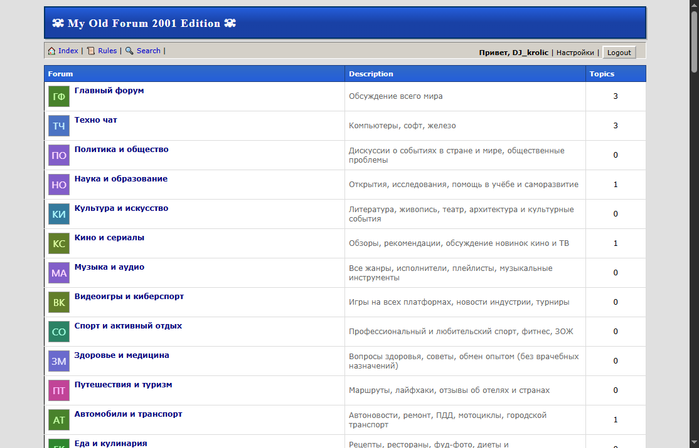

# My Old Forum 2001 Edition 🖥️

[](https://forum.171443.xyz/) 
[](https://workers.cloudflare.com/)
[](https://developers.cloudflare.com/d1/)
[](LICENSE)

Ностальгический движок форума в стиле Windows 98/2001, работающий на edge-инфраструктуре Cloudflare.

---

## 🚀 Быстрый старт

### 1. Создайте D1 базу в Cloudflare
1. Зайдите в [Cloudflare Dashboard](https://dash.cloudflare.com/) → **D1**
2. Нажмите **Create database** → имя `forum-db`

### 2. Задеплойте инициализатор базы
1. Перейдите в **Workers & Pages** → **Create application**
2. Создайте Worker: Название `forum`, выберите шаблон "Hello World"
3. В настройках воркера (Settings → Bindings) добавьте привязку D1:
   - Variable name: `DB`
   - D1 database: `forum-db`
4. Нажмите **Edit code** и замените код на содержимое файла `initializatorDB.js`
5. Сохраните и задеплойте.
6. Откройте ссылку вашего воркера и добавьте в конце секретный ключ:
   `https://forum.ваш-аккаунт.workers.dev/?secret=mysupersecretkey`
   *(Вы должны увидеть сообщение: `Database initialized successfully!`)*

### 3. Задеплойте основной форум
1. Вернитесь в **Edit code** того же воркера.
2. Полностью замените код на содержимое файла `worker.js` (основной код форума).
3. Сохраните и задеплойте.

### 4. Готово! 🎉
Откройте ссылку вашего форумы:
`https://forum.ваш-аккаунт.workers.dev`

---

## 👤 Тестовые аккаунты

| Логин | Пароль |
| :--- | :--- |
| `Admin` | `admin123` |
| `Moderator` | `mod123` |
| `dev` | `dev123` |

---

## 🛠 Особенности
- Дизайн в стиле Windows 2000 / XP
- Полная работа с базой данных D1
- Регистрация, авторизация и создание тем
- Аватарки и иконки через DiceBear API
```
